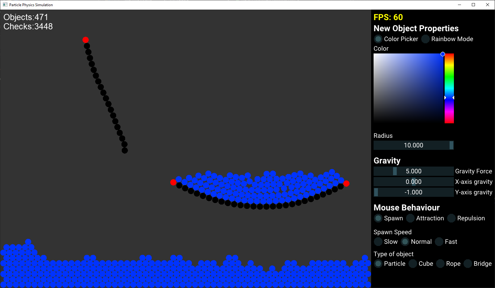

# Overview
This  application provides an interactive and visually engaging way to explore the dynamics of particle systems. It features a real-time 2D simulation where particles are influenced by gravity, collisions, and user interactions. With a range of customization options available through an intuitive GUI, users can tweak various parameters to observe different behaviors and effects.

# Key Features
- **Real-time 2D Particle Physics Simulation:** Simulates particles affected by gravity and collisions.
- **Verlet Integration:** Utilizes Verlet integration for stable and accurate physics simulation.
- **Uniform Grid for Collision Detection:** Efficiently solves collisions using a spatial partitioning grid.
- **Particle Links:** Connect particles with constraints, creating links that maintain specific distances.
- **GUI for Adjusting Parameters:** Control gravity, particle radius, attraction and repulsion forces, and more.
- **Mouse Interaction:** Spawn particles with a click, and apply attraction or repulsion forces using the mouse.
- **BitMap Font Rendering:** Displays number of objects and collision checks between them
- **OpenGL Instancing:** Renders particles efficiently using instancing for better performance.
# Dependencies
- **OpenGL:** For rendering graphics
- **GLFW:** For window management and handling input
- **GLM:** For mathematical operations and vector manipulation
- **ImGui:** For creating the graphical user interface
# Future Enhancements
- More efficient collision detection method
- Multithreading
- More complex physics interactions